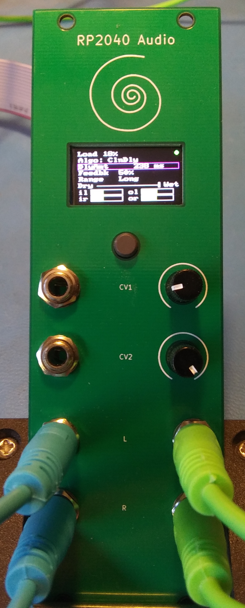
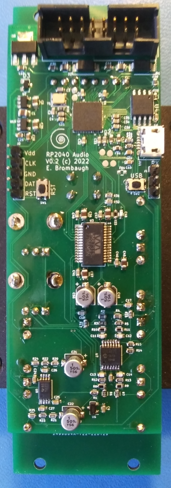

# RP2040_Audio
A Eurorack module for stereo audio effects based on the Raspberry Pi RP2040 MCU

  

## Abstract
I've been doing audio synthesis and effects in the Eurorack modular market for
a number of years. I started out in the late 2000's using the Microchip dsPIC
and migrated over to ARM Cortex M devices, mostly STM32 in order to get access
to higher speeds, more memory and floating point math. This was my main
platform for most of the 2010's until the great silicon drought of the 2020's
made high-end STM32 devices almost impossible to get. Into the vacuum stepped
the good folks at the Raspberry Pi Foundation with the RP2040 MCU which has
a fair chunk of on-chip SRAM, dual ARM Cortex M0 cores and a decent complement
of peripherals.

This project is a feasibility study of using the RP2040 MCU as an audio effects
processor, with particular emphasis on performance with challenging DSP.

## Hardware
The complete design consists of two PCBs:
* The system PCB - a single board containg all electrical components. Find it
in the Hardware directory.
* The Front Panel - a PCB-based front panel that conforms to the Eurorack
physical mounting standard. Found in the Hardware/audio_panel directory.

The system PCB has the following features:
* Standard Eurorack 16-pin shrouded power connector
* Two +/-5V CV inputs and associated analog signal conditioning 
* Two +/-7V Audio inputs and associated analog signal conditioning 
* Two +/-7V Audio outputs and associated analog drivers
* WM8731 stereo audio codec
* RP2040 and 4MB SPI flash with USB, SWD and serial interfaces for development
* 160 x 80 IPS LCD
* UI button

## Firmware
A demonstration firmware is included that exercises all of the capabilities of
the system, including the LCD, UI button, CV inputs and stereo audio I/O. It is
a basic multi-effects unit that supports a complement of audio DSP algorithms
that are easily extended by adding standardized modules to a data structure.
As provided here just three algorithms are available:
* Simple pass-thru with no processing
* Simple gain control
* Basic "clean delay" with crossfaded deglitching during delay changes.
Other algorithms have been tested including phasers, flangers, frequency shifters,
resampling delays and reverbs, but these are not publicly released at this time.

## Findings
Overall the RP2040 is a capable device that can do a reasonable amount of audio
DSP. The lack of floating point is not a huge incovenience if one is handy with
fixed point arithmetic and the large on-chip SRAM is sufficiently large for
reasonable audio data buffers. The PIO is handy for building interfaces and is
capable of full-duplex I2S with no difficulty. The on-chip ADC underperforms its
12-bit data width however and requires a fair bit of post-processing to remove
noise and jitter in the conversion results. The dual ARM cores are useful in
dividing up user interface and DSP tasks to keep a snappy response, but even
with two cores the system struggles to compete with higher-spec ARM systems.

TL;DR - you can use it for DSP, but I'd prefer a Cortex M7.
